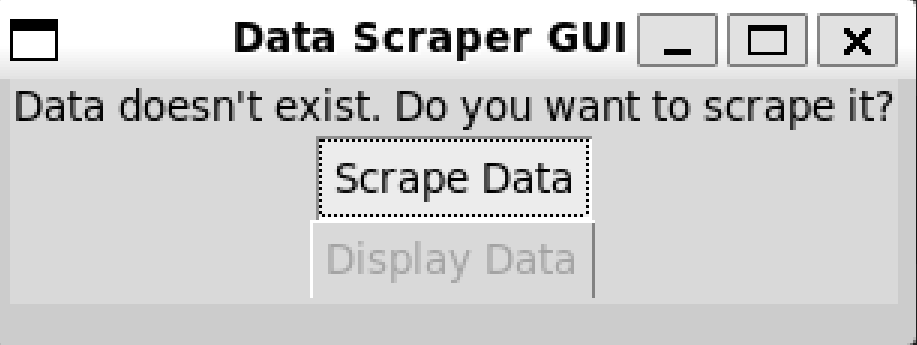
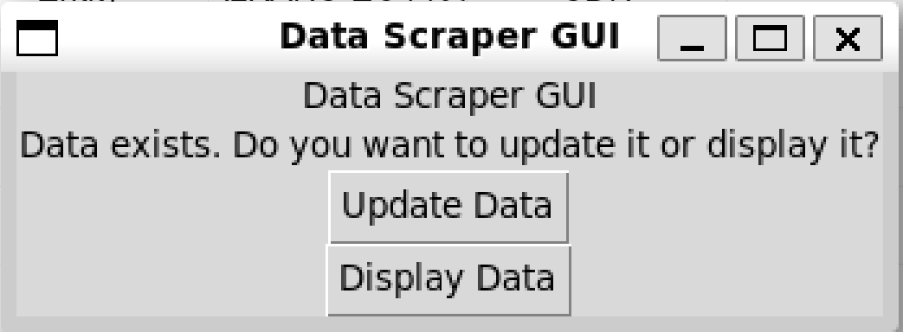
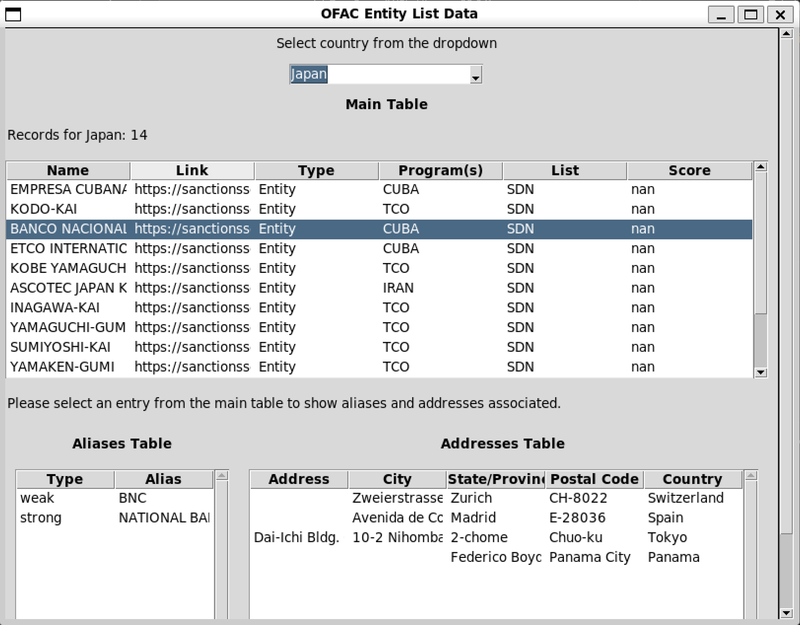

# OFAC Entity List Scraper

The OFAC Entity List Scraper is a Python project designed to scrape data from the Office of Foreign Assets Control (OFAC) Entity List website and display it in a graphical user interface (GUI). It utilizes web scraping techniques with Selenium and BeautifulSoup to extract data from the website, and then presents it in a user-friendly interface using Tkinter.

## Project Structure

The project consists of the following files:

- **scraper.py**: Contains the functions responsible for scraping data from the OFAC Entity List website.
- **gui.py**: Implements the graphical user interface for displaying the scraped data.
- **main.py**: The entry point of the application, where the GUI is created and run.
- **poetry.lock** and **pyproject.toml**: Poetry configuration files for managing dependencies and packaging.

## How It Works

The `scraper.py` module handles the scraping of data from the OFAC Entity List website. Leveraging Selenium for browser automation and BeautifulSoup for HTML parsing, it offers two key functions:

- `scrape_data_for_country`: This function retrieves data for a specified country. It iterates through each country, scraping its data in parallel using ThreadPoolExecutor.
- `scrape_data`: The main scraping function, it orchestrates the scraping process for all countries. If the data file doesn't exist, it prompts the user to scrape the data first.

### Parallelization in `scraper.py`:

The scraping process in the `scraper.py` module is optimized for efficiency by leveraging parallelization, allowing multiple countries to be scraped simultaneously. This is achieved using the ThreadPoolExecutor class from the concurrent.futures module.

1. **Parallel Scraping for Multiple Countries**:

   - The `scrape_data` function initiates the scraping process for all countries listed on the OFAC Entity List website.
   - By using ThreadPoolExecutor, multiple instances of the `scrape_data_for_country` function are executed concurrently, with each instance responsible for scraping data for a specific country.

     ```python
     with ThreadPoolExecutor(max_workers=5) as executor:
         results = executor.map(scrape_data_for_country, countries)
     ```
2. **Efficient Resource Utilization**:

   - By utilizing concurrent execution, the script maximizes resource utilization and minimizes the time required to scrape data for all countries.
   - The `max_workers` parameter controls the maximum number of worker threads used for parallel execution. Adjusting this value can optimize performance based on available system resources and network bandwidth.
3. **Random User Agents**:

   - To prevent detection and improve scraping efficiency, the `gen_random_user_agent` function generates a random user agent for each WebDriver instance.
   - This randomization helps in simulating diverse user behavior and avoids being blocked or rate-limited by the target website.

     ```python
     options.add_argument(f"user-agent={gen_random_user_agent()}")
     ```
4. **Error Handling and Retry Mechanism**:

   - During parallel scraping, errors such as network timeouts or missing elements in the HTML content may occur.
   - Error handling mechanisms, such as try-except blocks, are implemented within the `scrape_data_for_country` function to catch and handle exceptions gracefully.
   - In case of network errors, a brief delay is introduced before retrying the operation to mitigate transient issues.

     ```python
     except WebDriverException as wde:
         print(f"Network error occurred: {wde}. Retrying...")
         time.sleep(5)
         driver.refresh()
         continue
     ```
   - By incorporating error handling and retry mechanisms, the script ensures robustness and resilience in the face of potential issues encountered during parallel scraping.

### Error Handling in `scraper.py`:

2. **Attribute Errors**: When parsing HTML content with BeautifulSoup, attribute errors may occur if the expected elements are not found. These errors are caught using try-except blocks, and appropriate actions are taken, such as skipping to the next operation.

   ```python
   except AttributeError as ae:
       print("Details table not found. Moving on to next.", ae)
       continue
   ```

### Error Handling in `gui.py`:

1. **File Not Found Error**: When attempting to load the scraped data from the CSV file, a FileNotFoundError may occur if the file does not exist. This error is handled using a try-except block, and the GUI displays a message to inform the user that no data is available.

   ```python
   if os.path.exists("./data/sanctions_data.csv"):
       # Load the data from the CSV file
       ...
   else:
       tk.messagebox.showinfo("Info", "No data available. Please click on update data.")
   ```
2. **Invalid Data Format**: If the data in the CSV file is not in the expected format, errors may occur during data processing. While specific error handling for data format validation is not explicitly shown in the provided code, it can be implemented by checking for expected columns and data types before processing.

The **gui.py** module builds the graphical user interface using Tkinter. It dynamically updates the record count label based on the selected country and offers two main options:

- If the data file doesn't exist, the GUI prompts the user to scrape data.

  
- If the data file exists, the GUI provides options to either update the existing data or display it in a tabular format.

  

Finally, the **main.py** file acts as the entry point of the application. It initializes and runs the GUI by calling functions from the **gui.py** module, allowing users to interact with the scraping and display functionalities seamlessly.



## Setup and Usage

To set up and run the project, follow these steps:

1. Install Python (if not already installed) and ensure pip is available.
2. Install Poetry using the instructions from [the official Poetry documentation](https://python-poetry.org/docs/#installation).
3. Clone the project repository from GitHub:

   ```bash
   git clone <repository-url>
   ```
4. Navigate to project directory:

   ```bash
   cd ofac-demo
   ```
5. Create a virtual environment using `venv`:

   ```bash
   python -m venv venv
   source venv/bin/activate
   ```
6. Install project dependencies using poetry:

   ```bash
   poetry install
   ```
7. Run the `main.py` file to start the application

   ```bash
   python main.py
   ```
8. The GUI will open, allowing you to update the data or display it.

## Dependencies

The project uses the following dependencies:

- **pandas**: For data manipulation and analysis.
- **beautifulsoup4**: For parsing HTML content.
- **selenium**: For browser automation.
- **tkinter**: For creating the graphical user interface.
- **fake-useragent**: For generating random user agents.
- **concurrent.futures**: For parallel execution of scraping tasks.

The scraped file can be found under the `data` folder as `sanctions_data.csv`.
